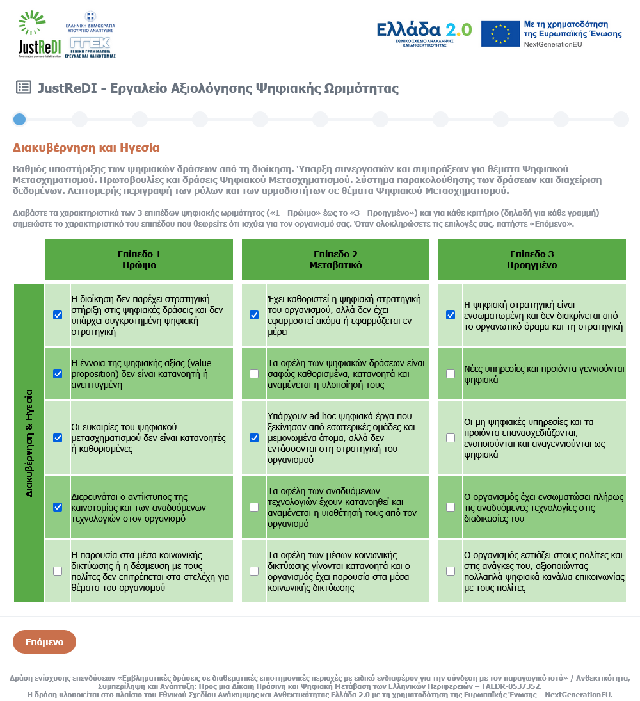

# JustReDI - Digital Maturity Assessment (DMA) Tool

The **DMA (Digital Maturity Assessment) Tool** was developed within the framework of the [JustReDI project](https://www.justredi.gr), and specifically the deliverable D8.1c, with the objective of evaluating the degree of digital maturity of businesses and organizations through an online, interactive platform. The implementation was based on modern open-source technologies, with an emphasis on functionality, ease of use, and seamless integration into research or organizational project environments.

## Backend

On the **backend**, the programming language **PHP** was used, communicating with a relational database **MariaDB**, fully compatible with MySQL. Responses are stored in a central table, which includes fields for individual answers by thematic section, section-specific scores, as well as the overall final score. Additionally, key metadata is recorded, such as the company's name, tax identification number (AFM), sector of activity, geographic region, and contact information.

## Frontend

The **frontend** was developed using **HTML and CSS**, without the use of specialized frameworks. The system ensures a simple user interface, with a fully customizable data entry form, based on custom CSS that allows for clear visual presentation and layout of elements. To enhance the visual understanding of the results by the user, the **Chart.js** library was integrated, which is used to create interactive charts that display the individual and overall performance of businesses across different thematic areas.

## Architecture

The architecture of the application is **monolithic**, with a clear separation between the presentation layer (HTML/CSS), the business logic (PHP), and data storage (MariaDB). The source code is organized into three main files: `index.php`, `api.php`, and `style.css`, maintaining a logic of simplicity and extensibility. The `api.php` file is specifically used for integrating the application with other platforms of the **JustReDI** project and for providing aggregated results regarding the digital maturity of businesses by geographic region and main economic activity.

## Online Deployment

The **DMA Tool** is deployed online at the following URL: [https://dma.justredi.gr](https://dma.justredi.gr/)
